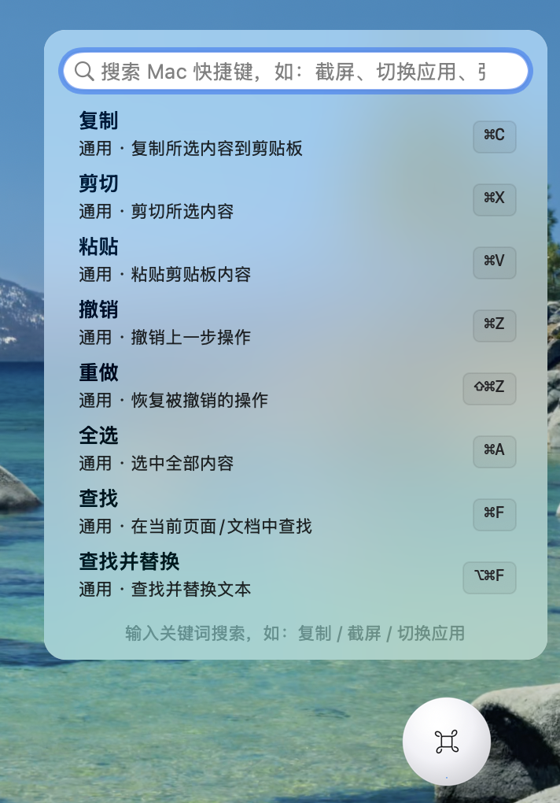
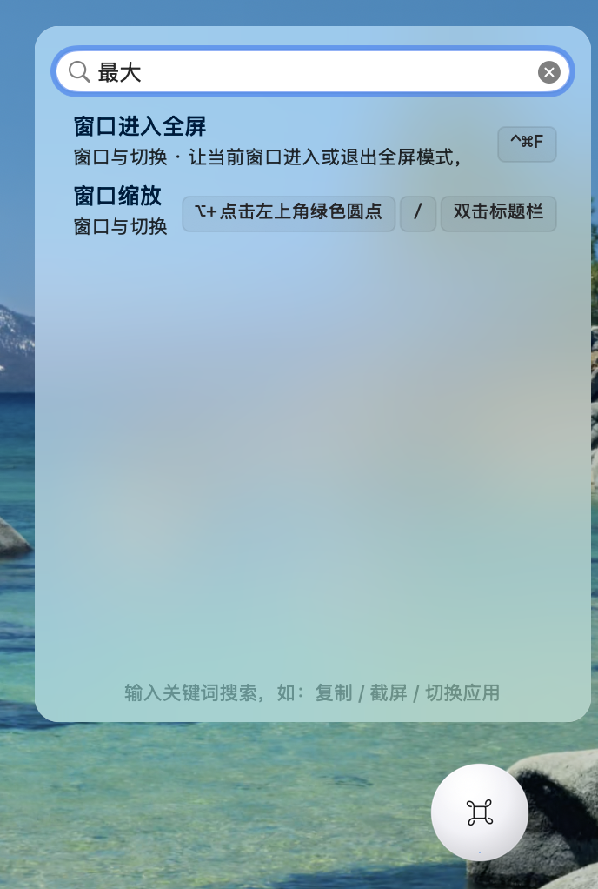
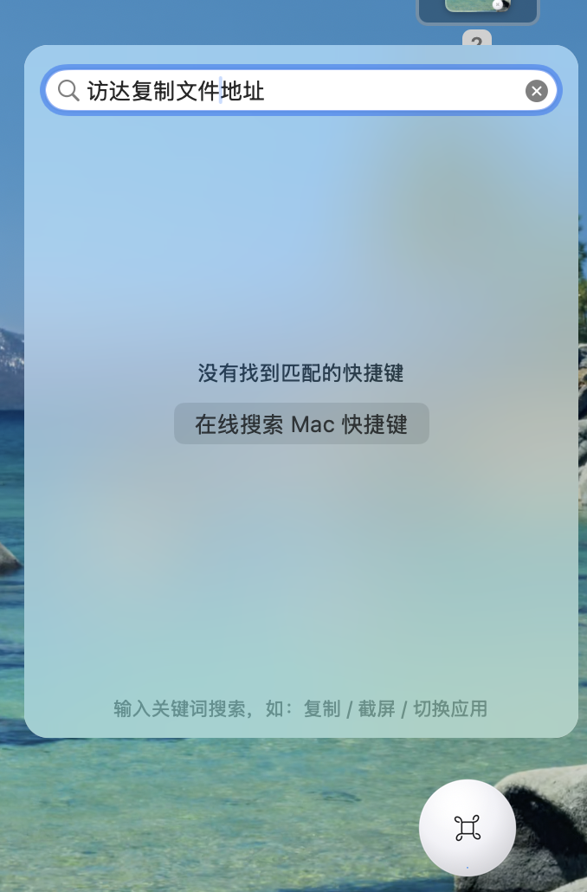

# ⚡ 快捷键悬浮球 · Mac Shortcut Ball


> 🚀 Made with ❤️ by **土立西西** · 项目主页：[GitHub](https://github.com/Tulixixi/MacShortcutBall) · 给个 ⭐ 就是最大的支持！

一个**原生 macOS** 桌面悬浮球小工具，专为「从 Windows 转用 Mac」的用户设计：想不起某个 Mac 快捷键时，点一下屏幕边缘的悬浮球，输入关键词（如「截屏」「复制」「切换应用」）即可秒查对应快捷键；本地查不到时，一键用浏览器联网搜索，链接自动带上 `Mac` 前缀，结果全是 Mac 相关。

---

## 📖 目录

- [缘起：我为什么做这个](#缘起我为什么做这个)
- [功能特性](#功能特性)
- [截图演示](#截图演示)
- [下载安装（不想编译？直接下 dmg）](#下载安装不想编译直接下-dmg)
- [使用说明](#使用说明)
- [自定义快捷键库](#自定义快捷键库)
- [技术架构](#技术架构)
- [构建与打包](#构建与打包)
- [Roadmap（计划中的功能）](#roadmap计划中的功能)
- [贡献指南](#贡献指南)
- [发布到 GitHub](#发布到-github)
- [关于作者 / 关注我](#关于作者--关注我)
- [开源协议](#开源协议)

---

## 缘起：我为什么做这个

我原来一直用 Windows，今年换成 Mac 笔记本后，**最大的卡点不是不会用，而是「肌肉记忆全错」**——想截图按 PrintScreen 没反应，想切换窗口按 Alt+Tab 跳到了别的地方。每次都要去搜「Mac 上这个操作到底按啥」，很打断思路。

市面上的快捷键工具要么太重、要么要记另一套唤起方式。我就想：能不能在屏幕上常年挂一个**不打扰、随手点、中文直接搜**的小球？于是用 CodeBuddy 写出了这个悬浮球——它只做一件事，但把这件事做到「想得起就查得到」。

如果你也是从 Win 转 Mac，或者只是想少记点快捷键，希望它能帮你省下那些「去找快捷键」的碎片时间。

---

## 功能特性

- **桌面悬浮球**：可自由拖拽，默认停靠屏幕右侧，位置自动记忆；无 Dock 图标，纯菜单栏 + 悬浮球，不打扰工作
- **点球即搜**：点击悬浮球弹出搜索面板，输入中文 / 英文关键词实时过滤
- **170+ 条常用 Mac 快捷键**：依据 Apple 官方文档整理，覆盖 9 大类——通用、Edge 浏览器、文件与访达、窗口与切换、系统、文字编辑、Safari、终端、截屏
- **命中高亮 + 完整显示**：关键词高亮，右侧快捷键文本完整不被裁切
- **一键复制**：双击搜索结果，快捷键文本（如 `Command + C`）直接进剪贴板
- **本地无结果 → 联网兜底**：面板提示「在线搜索 Mac 快捷键」，点击或回车即用浏览器打开 `https://www.bing.com/search?q=Mac+<关键词>`，**自动带上 `Mac` 前缀**，结果更精准
- **可隐藏 / 可自启**：右键悬浮球或菜单栏放大镜图标可隐藏 / 显示；支持「开机自动启动」
- **快捷键库可自定义**：编辑一个 JSON 文件即刻生效，不必改代码
- **零依赖**：纯 Swift 5 + AppKit，除系统框架外无任何第三方依赖

---

## 截图演示






---

## 下载安装（不想编译？直接下 dmg）

1. 打开本仓库右侧的 **Releases** 页面，下载最新的 `MacShortcutBall-1.0.dmg`
2. 双击 dmg，把 `MacShortcutBall.app` 拖入「应用程序」文件夹
3. 首次打开若提示「无法验证开发者」：右键 App → 打开，或到「系统设置 → 隐私与安全性」点「仍要打开」
4. 打开后，屏幕右侧会出现悬浮球 🟠

> 需要 macOS 11.0 及以上。

---

## 使用说明

| 操作 | 说明 |
| --- | --- |
| 点击悬浮球 | 展开 / 收起搜索面板 |
| 拖动悬浮球 | 移动位置（位置自动记忆） |
| 右键悬浮球 | 隐藏 / 重新加载 / 编辑 / 开机自启 / 退出 |
| 菜单栏放大镜图标 | 显示 / 隐藏悬浮球、编辑、开机自启、退出 |
| 搜索框输入 | 如 `截屏`、`复制`、`切换应用`、`force quit` |
| 双击搜索结果 | 复制快捷键文本到剪贴板 |
| 按 Esc 或点面板外 | 关闭搜索面板 |
| 本地无结果时按回车 | 打开浏览器在线搜索「Mac + 关键词」 |
| 开机自动启动 | 右键悬浮球 →「开机自动启动」；权限不足时手动到「系统设置 → 通用 → 登录项」添加 |

---

## 自定义快捷键库

应用首次启动会在以下位置生成模板文件：

```
~/Library/Application Support/MacShortcutBall/shortcuts.json
```

直接编辑该文件即可增删快捷键，然后「右键悬浮球 → 重新加载快捷键库」（或菜单栏菜单）立即生效。

每条记录字段说明：

```json
{
  "id": "copy",
  "name": "复制",                        // 显示名称
  "keys": "⌘C",                         // 快捷键（符号形式）
  "plain": "Command + C",               // 快捷键（文字形式，双击复制用）
  "category": "通用",                    // 分类
  "desc": "复制所选内容到剪贴板",         // 描述
  "keywords": ["复制", "copy"]          // 搜索关键词（中英文）
}
```

常用符号：`⌘` Command、`⇧` Shift、`⌥` Option、`⌃` Control、`⎋` Esc、`⏎` Return、`⌫` Delete、`␣` 空格。

---

## 技术架构

单文件 Swift 实现，结构清晰、易于阅读与二次开发：

| 模块 | 说明 |
| --- | --- |
| `main.swift` | 全部逻辑（约 900 行），无拆分、无第三方依赖 |
| `ShortcutItem` | 快捷键数据模型（`Decodable`），含中英文搜索字段 |
| `ShortcutStore` | 加载链：用户库 → 应用资源 → 同目录 → 内置兜底，保证永远可用 |
| `BallView` | 悬浮球视图（`NSView`），可拖拽、停靠记忆、悬停反馈 |
| `SearchPanel` | 无边框可输入面板（`NSPanel`），内嵌 `NSSearchField` + `NSTableView` 实时过滤 |
| `Branding` | 集中管理作者名 / GitHub 地址 / 显示名（发布前改这里） |
| 在线兜底 | 无结果时 `NSWorkspace.open` 打开 Bing（`Mac + query`） |
| 打包 | `build.sh` 用 `swiftc` 编译 → 组装 `.app` → `iconutil` 生成 icns → `hdiutil` 出 dmg |

**运行架构说明**：`build.sh` 使用 `swiftc -O` 编译，产物为**构建机当前架构的原生二进制**（Apple Silicon 上即为 `arm64`）。若需同时支持 Intel 与 Apple Silicon 的「通用二进制（Universal 2）」，在 `build.sh` 的 `swiftc` 命令中加入 `-arch arm64 -arch x86_64` 即可。

---

## 构建与打包

```bash
# 需要已安装 Xcode Command Line Tools
xcode-select --install

./build.sh            # 编译并生成 MacShortcutBall.app
./build.sh dmg        # 额外打包 MacShortcutBall-1.0.dmg（用于 GitHub Releases）
```

---

## Roadmap（计划中的功能）

- [ ] 搜索引擎可配置（Bing / Google / 百度 / 必应国际）
- [ ] 更多分类与「Win → Mac 对照」映射（直接搜 Windows 快捷键给 Mac 答案）
- [ ] 全局快捷键唤起搜索（不依赖点球）
- [ ] 浅色 / 深色自动跟随系统
- [ ] 快捷键库导入导出、社区共享包
- [ ] 英文界面（i18n）

欢迎提 Issue 或 PR 一起完善 🙌

---

## 贡献指南

1. Fork 本仓库并克隆到本地
2. 修改 `main.swift` 或 `shortcuts.json`
3. `./build.sh` 本地验证
4. 提交 PR，描述清楚改动与动机

新增快捷键请尽量标注来源（如 Apple 官方文档），保持 JSON 格式正确。

---

## 关于作者 / 关注我

我是 **土立西西**，一名软件工程师，从 Windows 移民 Mac，平时爱折腾 macOS 效率工具、也爱自己写点小玩意儿。

🧑‍💻 软件工程师 | 从 Win 移民 Mac
⌘ 分享 Mac 效率·快捷键·自己写的小工具
🟡 悬浮球作者 · 开源免费
📮 交流 / 合作看主页

- GitHub：[@Tulixixi](https://github.com/Tulixixi)
- 小红书：[@土立西西](https://xhslink.cn/m/1iW2JEYZC7C)
- 博客 / 其他：暂无独立博客，日常内容在小红书

如果这个小工具帮到了你，欢迎点 ⭐、提 Issue，或在小红书 @ 我分享你的使用场景 💬

---

## 开源协议

本项目基于 [MIT License](LICENSE) 开源，你可以自由使用、修改、分发，但请保留原作者署名。
